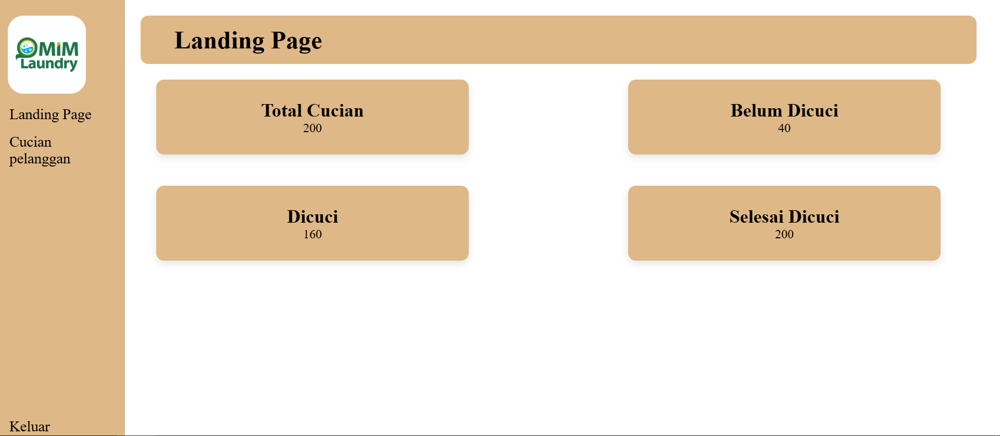
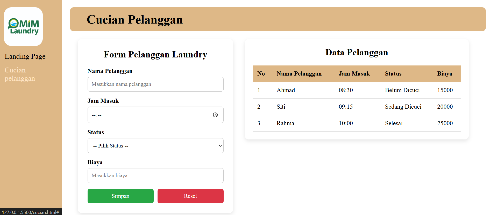

# MIM Laundry

Sistem manajemen laundry sederhana dengan fitur form pelanggan dan tabel data.

---

[View Online](https://twilight-user.github.io/UTS/)

## Preview

### Login Page


### Landing Page



### Cucian Page



## Fitur

- Form input data pelanggan laundry
- Tabel data pelanggan
- Dashboard dengan card info
- Desain responsif dengan sidebar

## Cara Menjalankan

Buka file `index.html` di browser, atau gunakan buka link diatas

## Struktur File

```
UTS/
├── index.html        # Halaman utama
├── cucian.html       # Halaman data cucian
├── landingPage.html  # Halaman landing
├── style/
│   └── style.css    # Styling CSS
└── README.md         # Dokumentasi
```

## Teknologi

- HTML5
- CSS3
